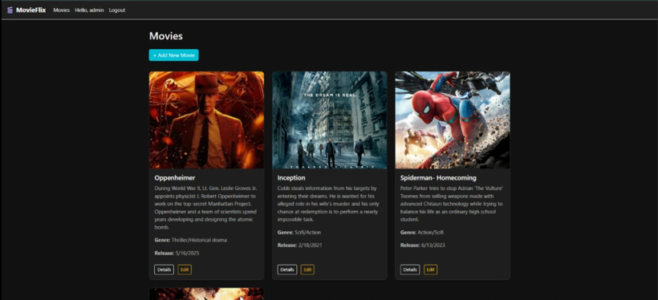
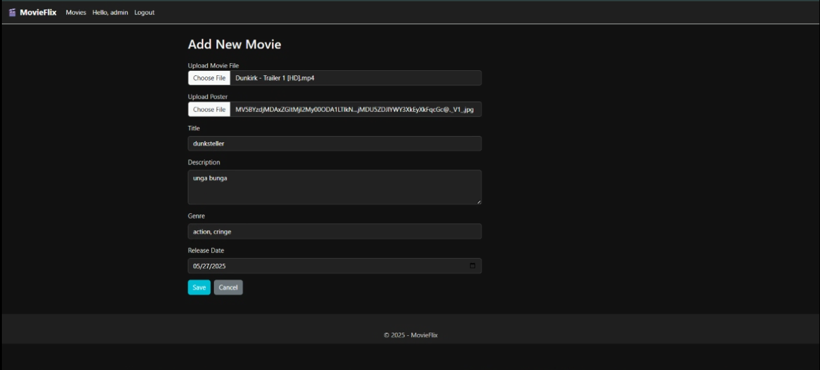
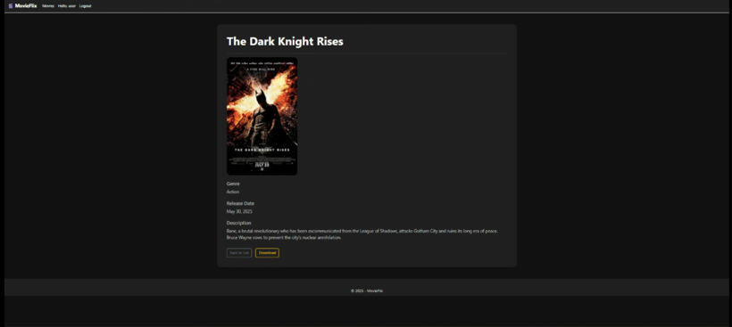
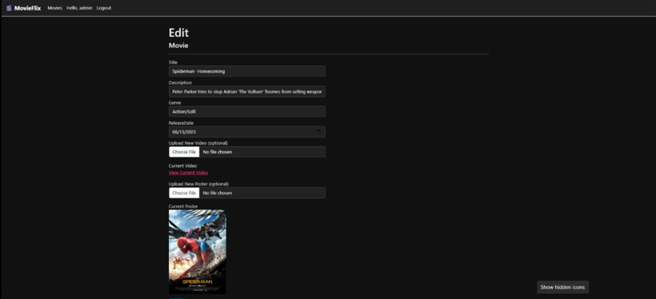

# 🎬 MovieFlix

**MovieFlix** is a modern, dark-themed ASP.NET Core MVC web application that allows users to browse, view, and download movies, while admins can upload and manage them with video and poster support. The platform features a clean interface, dynamic media handling, and role-based access.

---

## 🌟 Features

- 🗂️ **Browse Movie Listings** with title, genre, description, and release year
- 🎥 **Upload Movie Video Files** (Admin only)
- 🖼️ **Poster Upload Support**
- 📝 **Edit/Delete Movie Entries** (Admin-only)
- ⬇️ **Download Movie** (User-only)
- 🌙 **Fully Dark-Themed UI** for an immersive viewing experience
- 🔐 **Role-Based UI & Permissions** via session-based logic

---

## 🛠️ Technologies Used

- **ASP.NET Core MVC**
- **Entity Framework Core (EF Core)**
- **C#**
- **Bootstrap 5**
- **SQL Server / LocalDB**
- **JavaScript**

---

## 📸 Screenshots

---

## 🖼️ Media & File Handling

- 🎞️ Videos are stored under `/wwwroot/videos`
- 🖼️ Posters are stored under `/wwwroot/posters`
- Files are renamed using GUIDs to prevent conflicts
- Poster images are displayed with fixed resolution across views (cards, details, etc.)

---

## 🔐 Role Logic

- **Admin:** Can add, edit, and delete movies
- **User:** Can view and download movies

*(Username and Passwords for ADMIN and USER can be found inside Data folder in AppDbContext.cs)*

*Roles are managed through session state and can be expanded with full authentication in future versions.*

---

## 📌 Future Enhancements

- 🧑‍💻 Full user authentication with ASP.NET Identity
- 📊 Movie filtering, sorting, and search
- 📤 Upload progress indicators
- 🌍 Localization / multilingual support
- 🎫 Movie categories, ratings, and cast

---

## 🚀 How to Run the Project

Follow these steps to set up and run the **MovieFlix** project on your local machine using **Visual Studio**:

---

### Install Required NuGet Packages

Open **Package Manager Console** in Visual Studio and run the following commands one by one:

Install-Package Microsoft.EntityFrameworkCore

Install-Package Microsoft.EntityFrameworkCore.SqlServer

Install-Package Microsoft.EntityFrameworkCore.Tools

Install-Package Microsoft.AspNetCore.Session

Install-Package Microsoft.AspNetCore.Http

Install-Package Microsoft.VisualStudio.Web.CodeGeneration.Design

### Run the following EF Core commands to initialize and update the database

Add-Migration Init

Add-Migration AddPosterPathToMovie

Update-Database

### Configure the Connection String

1.Open SQL Server Management Studio (SSMS).

2.Copy your SQL Server name (e.g. DESKTOP-XXXXXXX\SQLEXPRESS).

3.In your project’s appsettings.json, update the ConnectionStrings:DefaultConnection field.

---

## 📄 License

This project is licensed under the **MIT License**. You are free to use, modify, and distribute it for both personal and commercial purposes.

---

## 👨‍💻 Author

Developed by [Tazrian Rafin] — A clean, modular ASP.NET Core application designed for real-world media management and full-stack learning.

---
